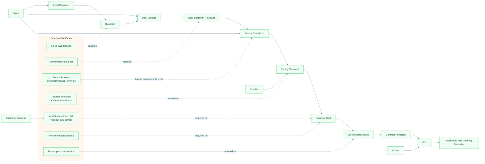
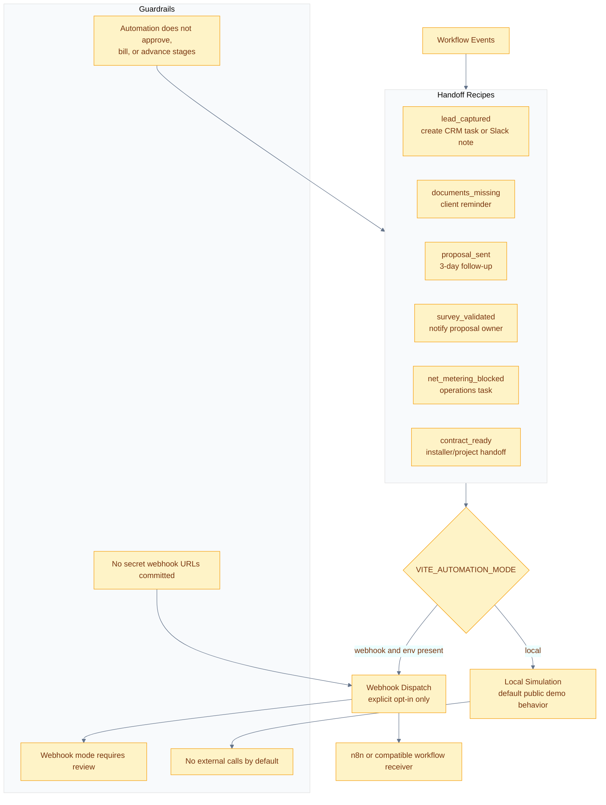

# Hyperion Platform Blueprints

These diagrams are the public architecture blueprints for the Hyperion v1 demo/reference platform. Mermaid source files and rendered images live in `docs/blueprints/`.

## Platform Overview

```mermaid
%%{init: {"theme": "base", "themeVariables": {"fontFamily": "Inter, Arial, sans-serif", "primaryColor": "#fff7ed", "primaryTextColor": "#1f2937", "primaryBorderColor": "#f59e0b", "lineColor": "#64748b", "secondaryColor": "#ecfeff", "tertiaryColor": "#f8fafc"}}}%%
flowchart TB
  subgraph Users["Users and Roles"]
    Owner["Owner"]
    Manager["Manager"]
    Sales["Sales"]
    CS["Customer Success"]
    Installer["Installer"]
    Customer["Customer"]
  end

  subgraph App["Hyperion React App"]
    Shell["App Shell and Route Config"]
    Overview["Overview"]
    Pipeline["Pipeline"]
    Workbench["Workbench"]
    Automations["Automations"]
    Analytics["Analytics"]
    Docs["Docs"]
    HiddenOps["Hidden Operational Routes<br/>Leads, Deals, Surveys, Documents,<br/>Proposals, Tickets, Settings"]
    PublicPages["Public Token Pages<br/>Inquiry, Remote Intake,<br/>Client Portal, Contract Signing"]
  end

  subgraph LocalDemo["Local Demo Mode"]
    LocalStore["solarOpsStore<br/>Local Orchestrator"]
    DemoSeed["Manual Demo Seed"]
    GoldenDemo["Iloilo Mini Mart<br/>Golden Demo"]
    LocalFiles["Local File Payloads"]
    LocalAutomation["Local Automation Simulation"]
  end

  subgraph Supabase["Supabase Production Boundary"]
    BusinessMutations["businessMutations Client"]
    EdgeFunctions["Edge Functions"]
    Auth["Supabase Auth"]
    Postgres["Postgres and RLS"]
    Storage["Private Storage Buckets"]
    PgVector["pgvector Report Chunks"]
  end

  subgraph External["External Services"]
    GoogleBrowser["Google Maps Browser Key"]
    GoogleServer["Google Solar and Routes Server Key"]
    Gemini["Gemini Bill OCR"]
    Vision["Google Vision OCR Fallback"]
    OpenAI["OpenAI Embeddings and Summaries"]
    N8N["Optional n8n Webhooks"]
  end

  Owner --> Shell
  Manager --> Shell
  Sales --> Shell
  CS --> Shell
  Installer --> Shell
  Customer --> PublicPages

  Shell --> Overview
  Shell --> Pipeline
  Shell --> Workbench
  Shell --> Automations
  Shell --> Analytics
  Shell --> Docs
  Shell --> HiddenOps

  Overview --> GoldenDemo
  Pipeline --> LocalStore
  Workbench --> LocalStore
  Automations --> LocalAutomation
  Analytics --> LocalStore
  HiddenOps --> LocalStore
  DemoSeed --> LocalStore
  GoldenDemo --> LocalStore
  LocalStore --> LocalFiles

  App -. "production mutation path" .-> BusinessMutations
  BusinessMutations --> EdgeFunctions
  EdgeFunctions --> Auth
  EdgeFunctions --> Postgres
  EdgeFunctions --> Storage
  EdgeFunctions --> PgVector

  PublicPages -. "production token access" .-> EdgeFunctions
  App --> GoogleBrowser
  EdgeFunctions --> GoogleServer
  EdgeFunctions --> Gemini
  EdgeFunctions --> Vision
  EdgeFunctions --> OpenAI
  LocalAutomation -. "opt-in webhook mode only" .-> N8N
```

## Operating Lifecycle

## Supabase And Edge Boundary

```mermaid
%%{init: {"theme": "base", "themeVariables": {"fontFamily": "Inter, Arial, sans-serif", "primaryColor": "#eff6ff", "primaryTextColor": "#1e3a8a", "primaryBorderColor": "#3b82f6", "lineColor": "#64748b", "secondaryColor": "#f8fafc", "tertiaryColor": "#fefce8"}}}%%
flowchart TB
  React["React UI<br/>local state, forms, route rendering"]
  Mutations["businessMutations.ts<br/>production mutation client"]

  subgraph Edge["Supabase Edge Functions"]
    Intake["lead-intake"]
    OCR["bill-ocr-preaudit"]
    Maps["maps-enrichment"]
    Snapshot["solar-snapshot"]
    Readiness["readiness-score"]
    RemoteCreate["remote-intake-create"]
    RemoteAccess["remote-intake-access"]
    RemoteUpload["remote-intake-upload"]
    DocUrl["document-signed-url"]
    DocValidate["document-validate"]
    Dispatch["survey-dispatch"]
    Evidence["survey-evidence-upload"]
    Proposal["generate-proposal"]
    Compliance["generate-compliance-docs"]
    Routes["installer-route-plan"]
    Report["report-rag"]
    Contract["contract-access"]
  end

  subgraph Data["Supabase Data Plane"]
    Auth["Auth<br/>staff user identity"]
    Staff["staff_profiles<br/>database roles"]
    DB["Postgres<br/>canonical operational records"]
    RLS["RLS Policies"]
    Buckets["Private Buckets<br/>readiness, survey evidence,<br/>deal files, compliance docs"]
    Vector["pgvector<br/>report_embedding_chunks"]
  end

  subgraph Secrets["Server-Side Secrets Only"]
    ServiceRole["SUPABASE_SERVICE_ROLE_KEY"]
    GeminiKey["GEMINI_API_KEY"]
    VisionKey["GOOGLE_VISION_API_KEY"]
    MapsKey["GOOGLE_MAPS_SERVER_KEY"]
    RemoteSecret["REMOTE_INTAKE_JWT_SECRET"]
    OpenAIKey["OPENAI_API_KEY"]
  end

  React -. "local demo uses solarOpsStore" .-> React
  React -. "production writes" .-> Mutations
  Mutations --> Edge

  Edge --> Auth
  Auth --> Staff
  Edge --> DB
  DB --> RLS
  Edge --> Buckets
  Report --> Vector

  ServiceRole --> Edge
  GeminiKey --> OCR
  VisionKey --> OCR
  MapsKey --> Maps
  MapsKey --> Snapshot
  MapsKey --> Routes
  RemoteSecret --> RemoteCreate
  RemoteSecret --> RemoteAccess
  RemoteSecret --> RemoteUpload
  OpenAIKey --> Report
```

## Automation Handoffs

